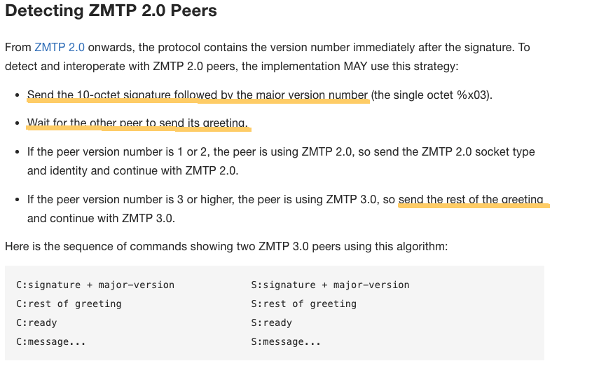
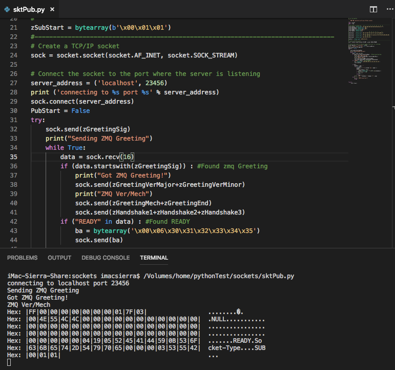
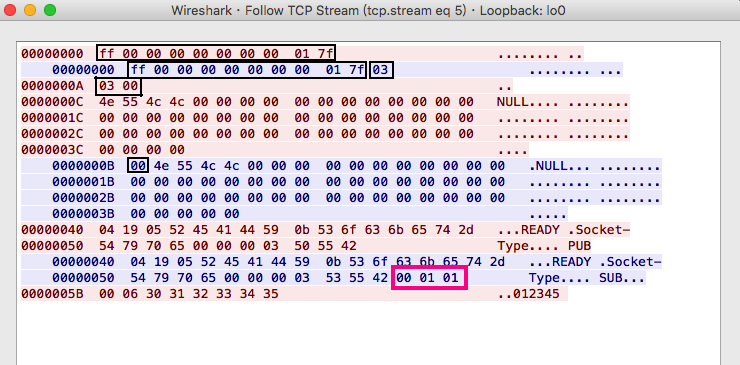
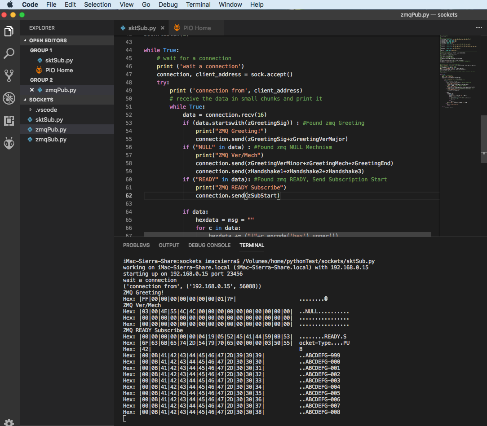
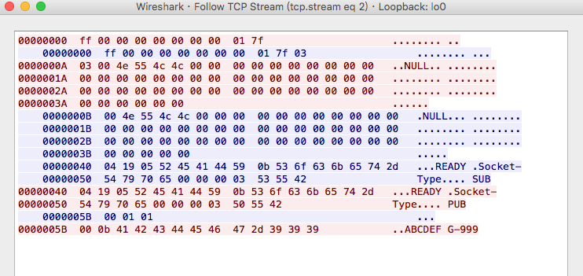
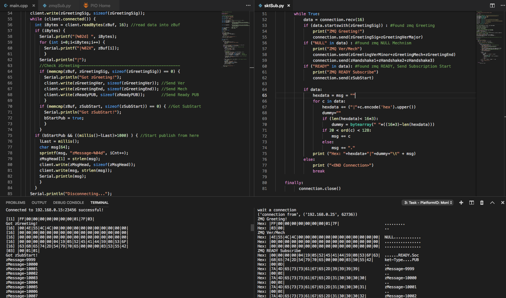

# zmqSocket ZMTP3.0 mini implementation w/o libZmq
  ZMTP3-SUB/PUB Python/Arduino-C++ 
  使用Python/Arduino sockets模擬ZMTP3-PUB/SUB的Greeting/Handshake並發送接收訂閱資料
   
  
# References
- [zmq guide](http://zguide.zeromq.org/)
- [minimum zmtp stuff](https://github.com/zeromq/zmtp/tree/master/zmtp30/C)
- [zmtp Wireshark dissector](https://github.com/whitequark/zmtp-wireshark/blob/master/zmtp-dissector.lua)
- [zmtp RFC spec](https://rfc.zeromq.org/spec:23/ZMTP/)
   
  
   
   
## Python sockets as subscriber <---> Pyzmq as publisher
## Python sockets as publisher <---> Pyzmq as subscriber
訂閱端 sockets only (sktSub.py) w/o Pyzmq <---> (zmqPub.py) 派送端 w/ Pyzmq  
派送端 sockets only (sktPub.py) w/o Pyzmq <---> (zmqSub.py) 訂閱端 w/ Pyzmq  
 

### ZMQ-PUB Python Simulation

### ZMQ-PUB Python Simulation Wireshark ZMTP Traffics
Publisher: color in red

### ZMQ-SUB Python Simulation

### ZMQ-SUB Python Simulation Wireshark ZMTP Traffics
Subscriber: color in blue

### (NEW) ESP32 project works for ZMTP3 Publish
ESP32 uses Arduino WiFiClient (w/o libZmq) to send ZMTP3 messages...

